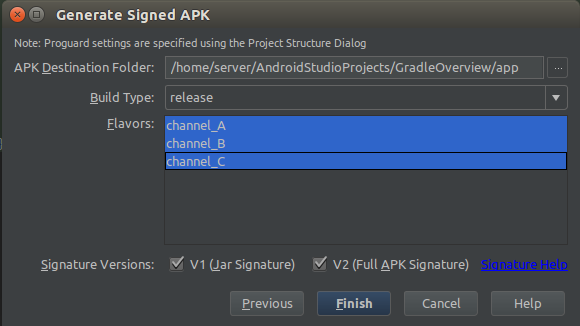
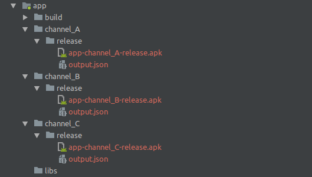
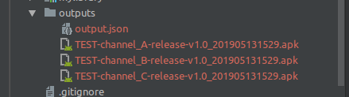
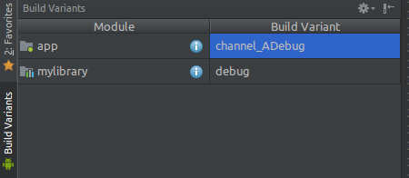

# Gradle配置简单使用说明
使用Android Studio已经有好长一段时间了，老实说，1.x版本的时候，还是蛮蛋疼的，经常导入一个库不是这里错就是那里错有时候半天都跑不起来，最后发现大多数时候都是由于自己对Gradle不太熟悉导致的，那么这里记录下自己对Gradle配置使用的一些心得。

## Android Studio中各个Gradle File
### Gradle File
首先我们一个最简单的项目中Gradle File的结构是这样的

 

### setting.gradle
其中project中的setting.gradle是最简单的一个了，它规定了当前project中到底有多少个Module参与编译,如下就表示当前项目中的app、mylibrary两个module参与编译

```groovy
include ':app', ':mylibrary'
```

## Project 中的build.gradle
- 默认的build.gradle

PS:这个文件中的配置会作用于整个工程，也就是所有参与编译的module，这也就决定了这个配置文件当然使用于定义一些共用的东西，我们先看下最简单的
```groovy
buildscript {

    //buildscript是针对gradle脚本本身执行所需的配置
    
    repositories {
        //这里定义的是gradle脚本本身执行所需的依赖查找路径
        google()
        jcenter()
    }
    
    dependencies {
        //此处定义编译插件的版本，这里就决定了我们编译过程中都会有哪些task（当然，并不包括我们自己定义的task）
        classpath 'com.android.tools.build:gradle:3.1.4'
    }
}

allprojects {

    //针对整个项目编译所需的配置
    
    repositories {
        //这里定义的使项目本身所需的依赖的查找路径，当然，这里我们可以指定多个。。。
        google()
        jcenter()
    }
}

task clean(type: Delete) {
    delete rootProject.buildDir
}
```
- 自定义全局通用属性

假如我们在整个项目的所有module中的build.gradle都用到的属性，那么可以考虑定义在project的build.gradle文件中,比如说如下字段
```groovy
ext{
    compileSdkVersion = 28
    buildToolsVersion = "28.0.0"
    minSdkVersion = 15
    targetSdkVersion = 28
    versionCode = 1
    versionName = "1.0"
}
```

当然，如果我们整个工程用到的公共属性超级多，并且想要比较方便的复用，比如说除了上面这几个基本的，还有apk输出路径、apk命名相关等等，我们大可以把这些值都定义到配置文件local.properties文件中，然后在gradle脚本执行的时候动态加载，如下：
```groovy
// 直接在build.gradle里面定义加载loadProperties的方法
def loadProperties() {
    def proFile = file("./local.properties")
    Properties pro = new Properties()
    proFile.withInputStream { stream->
        pro.load(stream)
    }

    //这里读取properties中定义的各个值，这里需要注意的是需要做类型转换，因为读取到的到时String类型的数据
    compileSdkVersion = Integer.valueOf(pro.compileSdkVersion)
    buildToolsVersion = pro.buildToolsVersion
    minSdkVersion = Integer.valueOf(pro.minSdkVersion)
    //...
}
// 这里记得调用，def处只是定义了loadProperties方法而已
loadProperties()

```


## module中的build.gradle
### 首先我们看下最简单的模式
```groovy
//决定编译目标,com.android.application表示编译成android应用，com.android.library表示编译成依赖库，，，，
apply plugin: 'com.android.application'

android {
    //编译规范SDK版本（在编译的时候起到代码检查和警告作用，有利于检查一些第三方库，或者代码的兼容性）
    compileSdkVersion rootProject.compileSdkVersion
    //编译工具版本(用于规范所有开发人员的编译版本)
    buildToolsVersion rootProject.buildToolsVersion

    defaultConfig {
        applicationId "com.discovery.gradleoverview"
        //应用支持的最低系统版本
        minSdkVersion rootProject.minSdkVersion
        //目标软件开发版本（就是我们应用程序开发过程中所使用的API版本，这个非常重要，关系到后续我们的程序运行行为）
        targetSdkVersion rootProject.targetSdkVersion
        //内部版本号，多数用于更新
        versionCode rootProject.versionCode
        //外部版本号，用于显示给用户看的
        versionName rootProject.versionName
        //用于支持单元测试
        testInstrumentationRunner "android.support.test.runner.AndroidJUnitRunner"
        //解决All flavors must now belong to a named flavor dimension.错误
        flavorDimensions "versionCode"
    }
    
    //针对lint检查的配置
    lintOptions {
        abortOnError false//即使报错也不会停止打包
        checkReleaseBuilds false//打包release版本的时候进行检测
    }   

    //签名配置,这个配置记得放在buildTypes前面，否则编译报错
    signingConfigs {
        releaseConfigs {
            //两种不同的apk安全验证
            v1SigningEnabled true
            v2SigningEnabled true
            storeFile file(project.rootDir.absolutePath + File.separator + 'keystore/discovery.jks')
            storePassword "123456"
            keyAlias "discovery"
            keyPassword "123456"
        }
        debugConfigs {
            v1SigningEnabled true
            v2SigningEnabled true
            storeFile file(project.rootDir.absolutePath + File.separator + 'keystore/debug.keystore')
            storePassword "android"
            keyAlias "androiddebugkey"
            keyPassword "android"
        }
    }

    buildTypes {
        release {
            minifyEnabled false
            proguardFiles getDefaultProguardFile('proguard-android.txt'), 'proguard-rules.pro'
            signingConfig signingConfigs.releaseConfigs
        }
        debug {
            signingConfig signingConfigs.debugConfigs
        }
    }
}

//依赖库
dependencies {
    implementation fileTree(include: ['*.jar'], dir: 'libs')
    implementation 'com.android.support:appcompat-v7:28.0.0'
    implementation 'com.android.support.constraint:constraint-layout:1.1.3'
    testImplementation 'junit:junit:4.12'
    androidTestImplementation 'com.android.support.test:runner:1.0.2'
    androidTestImplementation 'com.android.support.test.espresso:espresso-core:3.0.2'
    implementation 'com.google.code.gson:gson:2.8.5'
    implementation project(':module_common')
    implementation files('libs/log4j-core-2.3.jar')
}
```
我们看到除了apply plugin之外，build.gradle主要分为android和dependencies，那么我们接下来围绕这两个展开

### dependencies节点是管理我们添加的依赖，分别有如下几种方式添加依赖：

- implementation files('libs/log4j-core-2.3.jar')
- implementation project(':module_common')
- implementation 'com.google.code.gson:gson:2.8.5'

其中第一第二种就不说了，添加的使本地依赖，第三种就比较特别了，是在线获取的，其实最后还是引入jar或者使arr，就是上面的gson一样最后同步完成后我们使可以在工程根目录的External Libraries节点下找到相关的jar包的，如下图：


那么这个jar是在哪来的呢？不知道大家还记不记得我们前面说的project build.gradle文件下有一个allprojects节点，里面的repositories中指定了若干代码仓库的，这个jar就是来自这里的其中一个仓库了。。。

#### 几个常用依赖关键字的说明
- implementation：这个表示当前依赖的库只能用于当前module
- api：这个跟以前菜单compile一样表示当前依赖的库允许其它依赖了当前module的module使用，就是依赖可传递
- compileOnly：compileOnly和provided效果是一样的，只在编译的时候有效， 不参与打包
- runtimeOnly：runtimeOnly 和 apk效果一样，只在打包的时候有效，编译不参与
- testImplementation：testImplementation和testCompile效果一样，在单元测试和打包测试apk的时候有效

### android节点说明

android节点能配置的东西就非常多了，这里我们列举一些常用的.

#### 1、defaultConfig

NDK相关配置
```groovy
    ndk {
        moduleName  "daemon-jni"
        ldLibs "log"
        abiFilters "armeabi", "armeabi-v7a", "x86"
    }
```

#### 2、lintOptions

lintOptions主要是针对编译时lint工具的静态代码检查工具的配置，比如过对一些可能会出现的空指针、遗漏的break等代码潜在问题进行检查以及出问题后是否继续编译的控制，其主要配置大概有下面这些：

```groovy
    abortOnError false // true--错误发生后停止gradle构建
    gnoreWarnings true  // true--忽略Warnings类型的报告
    checkAllWarnings true  // true--检查所有问题点，包含其他默认关闭项
    warningsAsErrors true  // true--所有warning当做error
    disable 'TypographyFractions','TypographyQuotes'  // 关闭指定问题检查
    enable 'RtlHardcoded','RtlCompat', 'RtlEnabled'  // 打开指定问题检查
    check 'NewApi', 'InlinedApi'  // 仅检查指定问题
    showAll true  // true--显示错误的所有发生位置
    textReport true  // true--生成txt格式报告(默认false) 
    xmlReport false  // true--生成XML格式报告
    xmlOutput file("lint-report.xml")  // 指定xml报告文档(默认lint-results.xml)
    htmlReport true  // true--生成HTML报告(带问题解释，源码位置，等)
    checkReleaseBuilds true  //  true--所有正式版构建执行规则生成崩溃的lint检查，如果有崩溃问题将停止构建
    ignore 'TypographyQuotes'  // 忽略指定问题的规则(同关闭检查)
```

#### 3、buildTypes常用的两种编译类型定义

常用的编译类型有两种，release，和debug

这两种类型中常用的配置如下：
```groovy
    debbuggable true  //该构建类型是否生成一个可调式的apk
    minifyEnabled true  //是否可以移出无用的java代码，默认为false
    multiDexEnabled true //是否可以分包
    multiDexKeepProguard  //指定用在main dex 的类上的混淆文件，跟系统混淆文件联合使用
    proguardFiles  //指定插件使用的混淆文件
    signingConfig signingConfigs.releaseConfigs //签名配置
    zipAlignEnabled true //是否使用zipAlign优化apk,Android sdk包里面的工具，能够对打包的应用程序进行优化，让整个系统运行的更快
    versionNameSuffix "xxxx" ///VersionName的后缀
```

其中这上面有一个signingConfig的配置项我们引用了signingConfigs.releaseConfigs，下面我们介绍下这个配置都有哪些。。。

#### 4、signingConfigs

这个是签名相关的配置，通用也有releaseConfigs和debugConfigs两种类型的配置，这里我们看下releaseConfigs的常见配置：
```groovy
    v1SigningEnabled true
    v2SigningEnabled true
    storeFile file(project.rootDir.absolutePath + File.separator + 'keystore/discovery.jks') //指定签名文件
    storePassword "123456" //签名文件密码
    keyAlias "discovery" //签名文件别名
    keyPassword "123456" //签名文件别名密码
```
- 这其中v1SigningEnabled跟v2SigningEnabled两项是用于对apk做安全性校验的，一般都置为true即可，他们对应的是我们打包时勾选的两个选项，如下图


配置完signingConfigs跟buildTypes后，我们打包就方便很多了，只需要Build->Build APK(s)即可方便的编译出对应的签名包了，但是在编译之前还得选一些类型，否则gradle插件并不知道你需要用到的使debug的配置还是release的配置，选择方式如下：


PS:这里特别提一点，signingConfigs的配置需要放在buildTypes的前面，否则编译时会报错

#### 5、sourceSet

sourceSet的字面意思是资源集合，其实也如其名，它大多使用来对资源自己控制的，能配置的项很多，我们下面列举一些常用的

```groovy
sourceSets {
    main {
    
        // 下面这部分都是用来指定一些编译相关文件的路径配置，以前一般用于兼容eclipse项目
        // 现在的android studio已经做了兼容，所以比较少用到了，这个就不多说，看前缀就大概知道各个配置都是针对哪些文件的了
        manifest.srcFile 'AndroidManifest.xml'
        java.srcDirs = ['src']
        resources.srcDirs = ['src']
        aidl.srcDirs = ['src']
        renderscript.srcDirs = ['src']
        res.srcDirs = ['res']
        assets.srcDirs = ['assets']
         
        // 当我们想要在编译不同版本的apk时使用不同的资源文件，比如过debug版本跟
        // release版本选择不同mainfest文件，可以按照以下方式配置
        if (IS_DEBUG.toBoolean()) {
            manifest.srcFile 'src/main/debug/AndroidManifest.xml'
        }
        
        // 配制exclude关键字指定debug路径之后，那么编译的时候debug文件夹下的所有文件将不会被打包到apk中
        java {
            exclude '/debug/**'  // 不想包含文件的路径
        }
    }
}
```

这里我们稍微提一下IS_DEBUG，这个值其实我们可以定义在gradle.properties中，这里定义的变量是整个工程都可以访问到的

#### 6、compileOptions

配置java编译选项，一般配置如下：

```groovy
    compileOptions {
        //Java源文件的编码格式
        encoding 'UTF-8' 
        //JDK版本
        sourceCompatibility JavaVersion.VERSION_1_7
        //虚拟机兼容版本
        targetCompatibility JavaVersion.VERSION_1_7
    }
```

当然，这里我们只是在某个module中的build.gradle中进行配置，所以这个JDK版本也只对当前module起作用，如果我们想对让所有module都使用一致的JDK,那么可以在Project的build.gradle中进行配置，如下：

```groovy

    allprojects {
        repositories {
            jcenter()
        }

        tasks.withType(JavaCompile) {
            encoding 'UTF-8'
            sourceCompatibility = JavaVersion.VERSION_1_7
            targetCompatibility = JavaVersion.VERSION_1_7
        }
    }

```

#### 7、productFlavors

productFlavors能定义的东西很多，其主要使给不同产品定义不同的风格，比如说包名，版本号，渠道号等等，如下：

```groovy
   channel_A {
        dimension "code"
        manifestPlaceholders = [DISCOVERY_CHANNEL_VALUE: "channel-A"]
        applicationIdSuffix "com.xxx.xxx.xxx"
        versionCode 1
        versionName "1.0.0"
   }
```

我平时也只是用来配置多渠道打包比较多，其它的基本没试过，只是知道有怎么回事而已，所以这里只介绍多渠道的相关事宜：

说到多渠道打包我们先说说在为什么要有多渠道打包，所谓的渠道其实并没有严格的定义可以由我们自己定义，比如说我们可以把某个应用市场称为一个驱动
又或者说如果我们做的使智能硬件的设备，并不需要把APK发布到应用市场，那么我们可以把针对某一产品型号的apk称为一个渠道，那么多渠道打包都有哪些作用？
- 针对应用的一些数据统计比如说下载量、更新量等等的一些数据统计进行按不同渠道分类保存，以便后台进行数据分析，得出不同渠道的应用使用情况，那么在代码的角度去看这个问题的话我们其实需要的仅仅是一个标识（就是所谓的渠道号）去区分即可，这是多渠道打包的第一个目的也是最主要的目的。
- 其次就是批量打包，假如我们需要打100个渠道包，如果我们按正常方式一个个去打，每打一个渠道的apk就去改一下渠道号，岂不是疯掉？
- 第三就是方便出包时命名分类，如果我们打出来的包都是同一个名字，那岂不是无法区分哪个apk是哪个渠道的？那么如果我们在输出apk时顺便把渠道号带入命名中，那岂不是两全其美？

多渠道打包的配置：
- 首先我们需要在AndroidManifest.xml文件中定义渠道号占位符

```xml
    <meta-data
        android:name="DISCOVERY_CHANNEL"
        android:value="${DISCOVERY_CHANNEL_VALUE}">
    </meta-data>
```
这里我们的meta-data的name属性，我们可以通过name所定义的属性在代码中获取到DISCOVERY_CHANNEL_VALUE对应的值，这样我们就可以跟据该值做不同的操作了。紧接着是
meta-data的value属性，这里我们使用${DISCOVERY_CHANNEL_VALUE}的方式作为占位符，当我们打包时在productFlavors中定义的值就会被赋给DISCOVERY_CHANNEL_VALUE了

- productFlavors的配置${DISCOVERY_CHANNEL_VALUE}

```groovy
productFlavors {
        //打包的时候，会把channel_A等值分别对应不同的渠道包赋值给manifest中定义的占位符DISCOVERY_CHANNEL_VALUE
        channel_A {
            manifestPlaceholders = [DISCOVERY_CHANNEL_VALUE: "channel_A"]
        }
        channel_B {
            manifestPlaceholders = [DISCOVERY_CHANNEL_VALUE: "channel_B"]
        }
        channel_C {
            manifestPlaceholders = [DISCOVERY_CHANNEL_VALUE: "channel_C"]
        }
    }  
```

配置完成后，我们尝试编译，你会发现表编译时选择的界面不一样了，出现了我们在productFlavors中配置的几个渠道，这里我们就可以根据我们的需求选择不同的渠道了：



此时我们按住shift用鼠标选择，finish，编译完成后可以看到我们工程目录下不同渠道的apk了，如下：




自定义打包名称，统一apk保存目录：

当然，打完包之后，我的内心依然有点崩溃的，毕竟我们只看到了apk命名上只有渠道号，并没有一眼就看得出版本号之类的东西，毕竟我们测试阶段经常出包也是再正常不过的事情，那么我们需要给所有的apk分渠道之外、还得分版本，这样便于管理
，当然，这个我们也是可以通过gradle来配置实现的，接下来我们就通过配置来实现自定义apk命名，顺便统一一下apk存放的目录。

```groovy
    //在android节点下
    applicationVariants.all { variant ->
        variant.outputs.all {
            // 自定义输出路径
            variant.getPackageApplication().outputDirectory =
                    new File(project.rootDir.absolutePath + File.separator + "outputs")
            // 自定义文件名{示例：AppName-channel-A-debug-v1.0.0_201807301409.apk
            outputFileName = PROJECT_NAME+"-${variant.productFlavors[0].name}-${variant.buildType.name}-v${variant.versionName}_${Time()}.apk"
        }
    }
```

此时我们就可以开始编译了，然后就报错了，因为我们还没有定义Time()方法，其实这也是我们使用gradle配置的一个很重要的功能，如下：
```groovy
    static def Time() {
        return new Date().format("yyyyMMddHHmm", TimeZone.getTimeZone("GMT+08:00"))
    }
```

这次我们打包看看生成的apk，是不是都在outputs目录下，命名方式是不是都按照我们预想的一样：



很明显，是这样的。。。。

PS：这里要特别强调一下，我们配置多渠道打包之后，并不能像之前一样直接通过Build->Build APK(s)这中方式来打包的，这样只会生成个apk，
原因是Build Variants规定了Build->Build APK(s)这种编译方式的范围，如下图：



也就是说此时的Build->Build APK(s)只会编译出channel-A这个渠道号的Debug版本的apk，所以我们利用Gradle编译渠道包时，还是需要走正常的
编译流程Build-> Generate Signed APK...

至此，我们针对Gradle配置多渠道的就算基本完事了。

#### 8、packagingOptions

这个选项经常被用于忽略某些文件，也不知道什么原因，有时候android studio编译的时候会给我们报jar里面文件冲突的问题，大概报了如下信息：

Error:Execution failed for task ':app:packageDebug'.
> Duplicate files copied in APK META-INF/LICENSE.txt
    File 1: /Users/weichunsheng/Documents/android_app/app/libs/xxxxx-x.x.x.jar
    File 2: /Users/weichunsheng/Documents/android_app/app/libs/xxxxx-x.x.x.jar
    
要解决着列问题，使用packagingOptions就可以了，常用的都有下面这些：
```groovy
    packagingOptions {
        exclude 'META-INF/DEPENDENCIES.txt'
        exclude 'META-INF/LICENSE.txt'
        exclude 'META-INF/NOTICE.txt'
        exclude 'META-INF/NOTICE'
        exclude 'META-INF/LICENSE'
        exclude 'META-INF/DEPENDENCIES'
        exclude 'META-INF/notice.txt'
        exclude 'META-INF/license.txt'
        exclude 'META-INF/dependencies.txt'
        exclude 'META-INF/LGPL2.1'
    }
```


