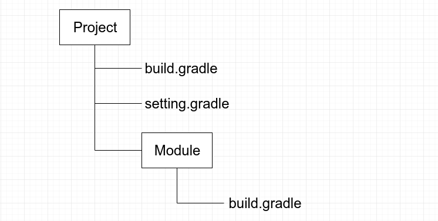

#Gradle配置简单使用说明
使用Android Studio已经有好长一段时间了，老实说，1.x版本的时候，还是蛮蛋疼的，经常导入一个库不是这里错就是那里错有时候半天都跑不起来，最后发现大多数时候都是由于自己对Gradle不太熟悉导致的，那么这里记录下自己对Gradle配置使用的一些心得。

##Android Studio中各个Gradle File
- 首先我们一个最简单的项目中Gradle File的结构是这样的
 