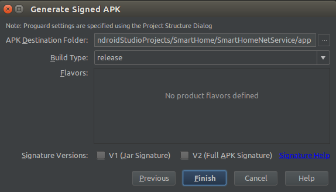
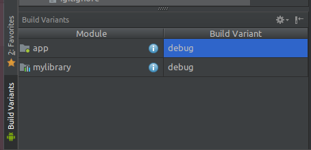

# Gradle配置简单使用说明
使用Android Studio已经有好长一段时间了，老实说，1.x版本的时候，还是蛮蛋疼的，经常导入一个库不是这里错就是那里错有时候半天都跑不起来，最后发现大多数时候都是由于自己对Gradle不太熟悉导致的，那么这里记录下自己对Gradle配置使用的一些心得。

## Android Studio中各个Gradle File
### Gradle File
首先我们一个最简单的项目中Gradle File的结构是这样的

 

### setting.gradle
其中project中的setting.gradle是最简单的一个了，它规定了当前project中到底有多少个Module参与编译,如下就表示当前项目中的app、mylibrary两个module参与编译

```groovy
include ':app', ':mylibrary'
```

## Project 中的build.gradle
- 默认的build.gradle

PS:这个文件中的配置会作用于整个工程，也就是所有参与编译的module，这也就决定了这个配置文件当然使用于定义一些共用的东西，我们先看下最简单的
```groovy
buildscript {

    //buildscript是针对gradle脚本本身执行所需的配置
    
    repositories {
        //这里定义的是gradle脚本本身执行所需的依赖查找路径
        google()
        jcenter()
    }
    
    dependencies {
        //此处定义编译插件的版本，这里就决定了我们编译过程中都会有哪些task（当然，并不包括我们自己定义的task）
        classpath 'com.android.tools.build:gradle:3.1.4'
    }
}

allprojects {

    //针对整个项目编译所需的配置
    
    repositories {
        //这里定义的使项目本身所需的依赖的查找路径，当然，这里我们可以指定多个。。。
        google()
        jcenter()
    }
}

task clean(type: Delete) {
    delete rootProject.buildDir
}
```
- 自定义全局通用属性

假如我们在整个项目的所有module中的build.gradle都用到的属性，那么可以考虑定义在project的build.gradle文件中,比如说如下字段
```groovy
ext{
    compileSdkVersion = 28
    buildToolsVersion = "28.0.0"
    minSdkVersion = 15
    targetSdkVersion = 28
    versionCode = 1
    versionName = "1.0"
}
```

## module中的build.gradle
### 首先我们看下最简单的模式
```groovy
//决定编译目标,com.android.application表示编译成android应用，com.android.library表示编译成依赖库，，，，
apply plugin: 'com.android.application'

android {
    //编译规范SDK版本（在编译的时候起到代码检查和警告作用，有利于检查一些第三方库，或者代码的兼容性）
    compileSdkVersion rootProject.compileSdkVersion
    //编译工具版本(用于规范所有开发人员的编译版本)
    buildToolsVersion rootProject.buildToolsVersion

    defaultConfig {
        applicationId "com.discovery.gradleoverview"
        //应用支持的最低系统版本
        minSdkVersion rootProject.minSdkVersion
        //目标软件开发版本（就是我们应用程序开发过程中所使用的API版本，这个非常重要，关系到后续我们的程序运行行为）
        targetSdkVersion rootProject.targetSdkVersion
        //内部版本号，多数用于更新
        versionCode rootProject.versionCode
        //外部版本号，用于显示给用户看的
        versionName rootProject.versionName
        //用于支持单元测试
        testInstrumentationRunner "android.support.test.runner.AndroidJUnitRunner"
    }
    
    //针对lint检查的配置
    lintOptions {
        abortOnError false//即使报错也不会停止打包
        checkReleaseBuilds false//打包release版本的时候进行检测
    }   

    //签名配置,这个配置记得放在buildTypes前面，否则编译报错
    signingConfigs {
        releaseConfigs {
            //两种不同的apk安全验证
            v1SigningEnabled true
            v2SigningEnabled true
            storeFile file(project.rootDir.absolutePath + File.separator + 'keystore/discovery.jks')
            storePassword "123456"
            keyAlias "discovery"
            keyPassword "123456"
        }
        debugConfigs {
            v1SigningEnabled true
            v2SigningEnabled true
            storeFile file(project.rootDir.absolutePath + File.separator + 'keystore/debug.keystore')
            storePassword "android"
            keyAlias "androiddebugkey"
            keyPassword "android"
        }
    }

    buildTypes {
        release {
            minifyEnabled false
            proguardFiles getDefaultProguardFile('proguard-android.txt'), 'proguard-rules.pro'
            signingConfig signingConfigs.releaseConfigs
        }
        debug {
            signingConfig signingConfigs.debugConfigs
        }
    }
}

//依赖库
dependencies {
    implementation fileTree(include: ['*.jar'], dir: 'libs')
    implementation 'com.android.support:appcompat-v7:28.0.0'
    implementation 'com.android.support.constraint:constraint-layout:1.1.3'
    testImplementation 'junit:junit:4.12'
    androidTestImplementation 'com.android.support.test:runner:1.0.2'
    androidTestImplementation 'com.android.support.test.espresso:espresso-core:3.0.2'
    implementation 'com.google.code.gson:gson:2.8.5'
    implementation project(':module_common')
    implementation files('libs/log4j-core-2.3.jar')
}
```
我们看到除了apply plugin之外，build.gradle主要分为android和dependencies，那么我们接下来围绕这两个展开

### dependencies节点是管理我们添加的依赖，分别有如下几种方式添加依赖：

- implementation files('libs/log4j-core-2.3.jar')
- implementation project(':module_common')
- implementation 'com.google.code.gson:gson:2.8.5'

其中第一第二种就不说了，添加的使本地依赖，第三种就比较特别了，是在线获取的，其实最后还是引入jar或者使arr，就是上面的gson一样最后同步完成后我们使可以在工程根目录的External Libraries节点下找到相关的jar包的，如下图：


那么这个jar是在哪来的呢？不知道大家还记不记得我们前面说的project build.gradle文件下有一个allprojects节点，里面的repositories中指定了若干代码仓库的，这个jar就是来自这里的其中一个仓库了。。。

#### 几个常用依赖关键字的说明
- implementation：这个表示当前依赖的库只能用于当前module
- api：这个跟以前菜单compile一样表示当前依赖的库允许其它依赖了当前module的module使用，就是依赖可传递
- compileOnly：compileOnly和provided效果是一样的，只在编译的时候有效， 不参与打包
- runtimeOnly：runtimeOnly 和 apk效果一样，只在打包的时候有效，编译不参与
- testImplementation：testImplementation和testCompile效果一样，在单元测试和打包测试apk的时候有效

### android节点说明

android节点能配置的东西就非常多了，这里我们列举一些常用的.

#### 1、defaultConfig

- 多渠道打包
- NDK相关配置

#### 2、lintOptions

lintOptions主要是针对编译时lint工具的静态代码检查工具的配置，比如过对一些可能会出现的空指针、遗漏的break等代码潜在问题进行检查以及出问题后是否继续编译的控制，其主要配置大概有下面这些：

```groovy
    abortOnError false // true--错误发生后停止gradle构建
    gnoreWarnings true  // true--忽略Warnings类型的报告
    checkAllWarnings true  // true--检查所有问题点，包含其他默认关闭项
    warningsAsErrors true  // true--所有warning当做error
    disable 'TypographyFractions','TypographyQuotes'  // 关闭指定问题检查
    enable 'RtlHardcoded','RtlCompat', 'RtlEnabled'  // 打开指定问题检查
    check 'NewApi', 'InlinedApi'  // 仅检查指定问题
    showAll true  // true--显示错误的所有发生位置
    textReport true  // true--生成txt格式报告(默认false) 
    xmlReport false  // true--生成XML格式报告
    xmlOutput file("lint-report.xml")  // 指定xml报告文档(默认lint-results.xml)
    htmlReport true  // true--生成HTML报告(带问题解释，源码位置，等)
    checkReleaseBuilds true  //  true--所有正式版构建执行规则生成崩溃的lint检查，如果有崩溃问题将停止构建
    ignore 'TypographyQuotes'  // 忽略指定问题的规则(同关闭检查)
```

#### 3、buildTypes常用的两种编译类型定义

常用的编译类型有两种，release，和debug

这两种类型中常用的配置如下：
```groovy
    debbuggable true  //该构建类型是否生成一个可调式的apk
    minifyEnabled true  //是否可以移出无用的java代码，默认为false
    multiDexEnabled true //是否可以分包
    multiDexKeepProguard  //指定用在main dex 的类上的混淆文件，跟系统混淆文件联合使用
    proguardFiles  //指定插件使用的混淆文件
    signingConfig signingConfigs.releaseConfigs //签名配置
    zipAlignEnabled true //是否使用zipAlign优化apk,Android sdk包里面的工具，能够对打包的应用程序进行优化，让整个系统运行的更快
    versionNameSuffix "xxxx" ///VersionName的后缀
```

其中这上面有一个signingConfig的配置项我们引用了signingConfigs.releaseConfigs，下面我们介绍下这个配置都有哪些。。。

#### 4、signingConfigs

这个是签名相关的配置，通用也有releaseConfigs和debugConfigs两种类型的配置，这里我们看下releaseConfigs的常见配置：
```groovy
    v1SigningEnabled true
    v2SigningEnabled true
    storeFile file(project.rootDir.absolutePath + File.separator + 'keystore/discovery.jks') //指定签名文件
    storePassword "123456" //签名文件密码
    keyAlias "discovery" //签名文件别名
    keyPassword "123456" //签名文件别名密码
```
- 这其中v1SigningEnabled跟v2SigningEnabled两项是用于对apk做安全性校验的，一般都置为true即可，他们对应的是我们打包时勾选的两个选项，如下图



配置完signingConfigs跟buildTypes后，我们打包就方便很多了，只需要Build->Build APK(s)即可方便的编译出对应的签名包了，但是在编译之前还得选一些类型，否则gradle插件并不知道你需要用到的使debug的配置还是release的配置，选择方式如下：



PS:这里特别提一点，signingConfigs的配置需要放在buildTypes的前面，否则编译时会报错

#### sourceSet

sourceSet的字面意思是资源集合，其实也如其名，它大多使用来对资源自己控制的，能配置的项很多，我们下面列举一些常用的

- 配置so库目录

```groovy
sourceSets {
    main {
        jniLibs.srcDirs = ['libs']

    }
}
```

- 配置源码目录

用过as的应该都知道，我们的源码目录是src/java，当我们需要指定一些java文件加入到编译，并且不想放在java里面的时候

```groovy
    sourceSets {
        main {
            srcDirs = 'src/directory'
        }
    }
```

- 编译使动态选择某些文件

当我们想要在编译不同版本的apk时使用不同的资源文件，比如过debug版本跟release版本选择不同mainfest文件，可以按照以下方式配置

```groovy
    sourceSets {
        main {
            if (IS_DEBUG.toBoolean()) {
                manifest.srcFile 'src/main/debug/AndroidManifest.xml'
            }
        }
    }
```


